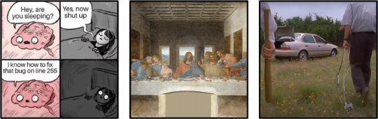

# [atet](https://github.com/atet) / [**_itt_**](https://github.com/atet/itt/blob/main/README.md#atet--itt)

[](#nolink)

# Images to Text

We're going to extract text-based meaning out of images here in <u><b>10 easy steps and less than 10 minutes</b></u>:

- Downloading and deploying a Python development environment
- Signing up for **free** access to Google language model API
- Code snippet to convert images to clean text

*This tutorial was developed in Windows 10 and will likely work with some minor changes in Windows 11, MacOS, and Linux.*

If you're looking to make images from text, see my quick tutorial here: [🚧 Under Construction 🚧](https://github.com/atet/tti)

----------------------------------------------------------------------------

## Standalone Python Environment

1. Set up Docker in Windows Subsystem for Linux: [My Quick Linux+Docker for Windows Tutorial](https://github.com/atet/wsl)
2. Download and deploy a Python development environment with JupyterLab in Docker: [My One-Step JupyterLab for Windows Tutorial](https://github.com/atet/python)

[Back to Top](#table-of-contents)

----------------------------------------------------------------------------

## Free Google AI Studio API Key

3. Follow the instructions here for only the `Google Gemini Access` section to get an API key: [My Getting Started with Free LLMs Tutorial](https://github.com/atet/copilot?tab=readme-ov-file#google-gemini-access)
4. Copy down your new API key and **do not share it with anyone else**, you will paste it in the code snippet below where you see `<YOUR_GOOGLE_API_KEY>`

[Back to Top](#table-of-contents)

----------------------------------------------------------------------------

## Dependencies

5. With your new JupyterLab container up and running, access its terminal through your local Windows WSL terminal (i.e., `docker exec` into the container that we named `jupyterlab` in the instructions from the other tutorial):

```bash
$ docker exec -it jupyterlab /bin/bash
(base) jovyan@jupyterlab:~$ _
```

6. Install the Google `genai` and `Pillow` Python libraries:

```bash
(base) jovyan@jupyterlab:~$ pip install google-genai Pillow
.
.
.
Successfully installed...
```

[Back to Top](#table-of-contents)

----------------------------------------------------------------------------

## Test Image

7. Right-click and "*Copy image link*" of this handwritten address scan:

    [](#nolink)

8. Take note of this URL as you will paste it in the code snippet below where you see `<URL_OF_IMAGE>`

[Back to Top](#table-of-contents)

----------------------------------------------------------------------------

## Python Code

9. Log into your Docker JupyterLab environment from a web browser at `localhost:8888` and use the word "`token`" as the password/token:

    [](#nolink)

10. Start a Jupyter Notebook, copy+paste the following code into the notebook, and run it:

```python
import requests
from io import BytesIO
from PIL import Image
from IPython.display import display
from google import genai
from google.genai import types

API_KEY =   "<YOUR_GOOGLE_API_KEY>"
image_url = "<URL_OF_IMAGE>"

image_bytes = requests.get(image_url, stream=True).content

# Display image within Jupyter Notebook
display(Image.open(BytesIO(image_bytes)))

# Query Google Gemini large language model with image (as byte array) and instructions (i.e., user prompt in triple quotes)
client = genai.Client(api_key = API_KEY)
response = client.models.generate_content(
   model = "gemini-2.0-flash",
   contents = [
      types.Part.from_bytes(data = image_bytes, mime_type = "image/jpeg"),
      """
      This is a handwritten address.
      Return only the text of this image properly formatted and address in the USA.
      Do not return anything other than your best guess at an address.
      """
   ]
)

# Print Google Gemini's response
print(response.text)
```

***And there you have it, all that in just a few minutes of learning how to convert images into clean text:***

[](#nolink)

[Back to Top](#table-of-contents)

----------------------------------------------------------------------------

## Next Steps

> Note that this image-to-text method leveraging large language models is **significantly better** than traditional optical character recognition algorithms that I've tried in Python and R.

Now you can try some other images and ask for various things like:
- Why is this comic strip funny?
- Describe the Last Supper as Leonardo da Vinci.
- What do you think happened to result in this picture?

    [](#nolink)

If you're looking to make images from text, see my quick tutorial here: [🚧 Under Construction 🚧](https://github.com/atet/tti)

[Back to Top](#table-of-contents)

----------------------------------------------------------------------------

## Other Resources

**Description** | **URL Link**
--- | ---
Google `genai` Python library documentation | https://pypi.org/project/google-genai/

[Back to Top](#table-of-contents)

----------------------------------------------------------------------------

## Troubleshooting

Issue | Solution
--- | ---
**"`API_KEY` is not defined?"** | Make sure to surround this text string in quotes, e.g., `"tHisISaDumMYapIKeY"`
**"`image_url` is not defined?"** | Make sure to surround this text string in quotes, e.g., `"https://github.com/atet/itt/raw/main/.img/address.jpeg"`
**"It's not working!"** | This concise tutorial has distilled hours of sweat, tears, and troubleshooting; _it can't not work_

[Back to Top](#table-of-contents)

----------------------------------------------------------------------------

<p align="center">Copyright © 2025-∞ Athit Kao, <a href="http://www.athitkao.com/tos.html" target="_blank">Terms and Conditions</a></p>